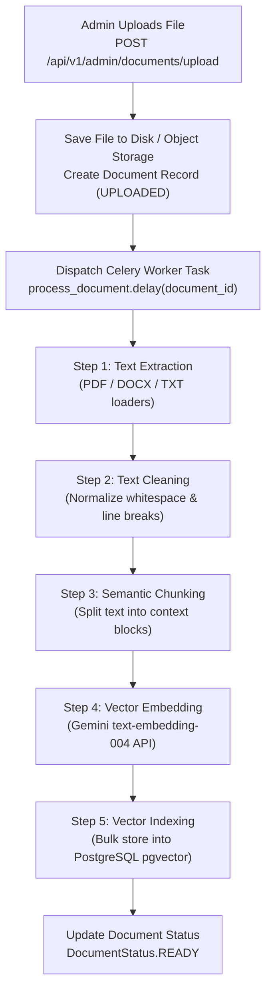
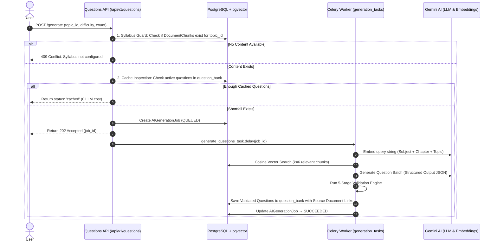

# SamAI — Document Upload & Question Generation Procedure

This document details the exact operational procedures, document upload hierarchy, and end-to-end question generation workflow in SamAI.

---

## 1. Core Architecture Principles

1. **Strict Closed-Book RAG**: SamAI never generates questions from the open internet or outside LLM memory. Every question is generated exclusively from institution-uploaded, approved reference materials.
2. **Full Source Traceability**: Every generated and banked question retains explicit foreign key links to its `source_document_id` and `source_chunk_id`.
3. **Automated Quality Control**: Multi-stage validation ensures answer key integrity, explanation traceability, difficulty targeting, topic relevance, and deduplication before any question enters the question bank.

---

## 2. Curriculum Setup Hierarchy

Before uploading files, the curriculum metadata hierarchy must be established in the database via the Admin API or Admin Portal (`http://localhost:3000/admin/upload`).

```
Exam Type (e.g., NEET)
 └── Subject (e.g., Physics)
      └── Chapter (e.g., Kinematics)
           └── Topic (e.g., Motion in a Straight Line)
```

---

## 3. Document Upload Order & Reference Types

When preparing content for a topic, upload documents in the following order:

```
Step 1: Textbook / Study Material  [REQUIRED]
        └── Step 2: Sample Questions / Past Papers  [OPTIONAL]
             └── Step 3: Exam Patterns / Blueprint  [OPTIONAL]
```

### Document Type Breakdown

| Priority | Document Type (`document_type`) | Purpose & Role in RAG | Requirement Level | Supported Extensions |
|---|---|---|---|---|
| **1** | **Textbook / Study Material** (`textbook`) | Primary source of facts. Text is extracted, cleaned, split into semantic chunks, and embedded into `pgvector`. | **REQUIRED** (Question generation is blocked if this is missing) | `.pdf`, `.docx`, `.doc`, `.txt` |
| **2** | **Sample Questions** (`sample_questions`) | Provides style, format, and structure references for Gemini prompt context without verbatim copying. | **OPTIONAL** | `.pdf`, `.docx`, `.txt` |
| **3** | **Exam Pattern** (`exam_pattern`) | Defines exam blueprints, mark allocations, option counts, and subject rules. | **OPTIONAL** | `.pdf`, `.docx`, `.txt` |

*Note: File upload size limit is **200 MB** per file. Automatic versioning handles updates when re-uploading documents for the same curriculum scope.*

---

## 4. Document Ingestion Pipeline (Asynchronous)

Document upload returns an instant HTTP 201 response while text processing, chunking, and vector embedding run asynchronously in a Celery background worker.



---

## 5. Question Generation & RAG Pipeline

When a student or admin requests practice questions (`POST /api/v1/questions/generate`), the system executes the following pipeline:



---

## 6. Automated 5-Stage Validation Engine

Every AI-generated question is evaluated against 5 validation rules before promotion to `question_bank`:

1. **Option Integrity**: Must contain at least 2 options and exactly 1 correct answer matching a valid option key (`A`, `B`, `C`, `D`).
2. **Explanation Quality**: Explanation must exist and cannot be identical to the question text.
3. **Difficulty Target**: Question difficulty must match requested target difficulty (`easy`, `medium`, `hard`).
4. **Topic Alignment**: Model output topic name must match requested curriculum topic.
5. **Deduplication Check**: Calculates fuzzy string similarity (`difflib.SequenceMatcher`) against all existing questions in the bank for this topic. Rejects any question exceeding **0.88 similarity**.

*Rejections are logged in `generated_questions` with explicit error reasons for auditing.*

---

## 7. Operational API Reference

### Document Management (Admin)
- **Upload Document**: `POST /api/v1/admin/documents/upload` (Form Data: `file`, `exam_type_id`, `document_type`, `subject_id`, `chapter_id`, `topic_id`)
- **Check Ingestion Status**: `GET /api/v1/admin/documents/{document_id}/status`
- **List Documents**: `GET /api/v1/admin/documents`

### Question Generation & Retrieval
- **Request Generation**: `POST /api/v1/questions/generate` (JSON: `exam_type_id`, `subject_id`, `chapter_id`, `topic_id`, `difficulty`, `count`)
- **Check Generation Job Status**: `GET /api/v1/questions/generation-jobs/{job_id}`
- **Fetch Banked Questions**: `GET /api/v1/questions?topic_id=...&difficulty=...&count=10`
